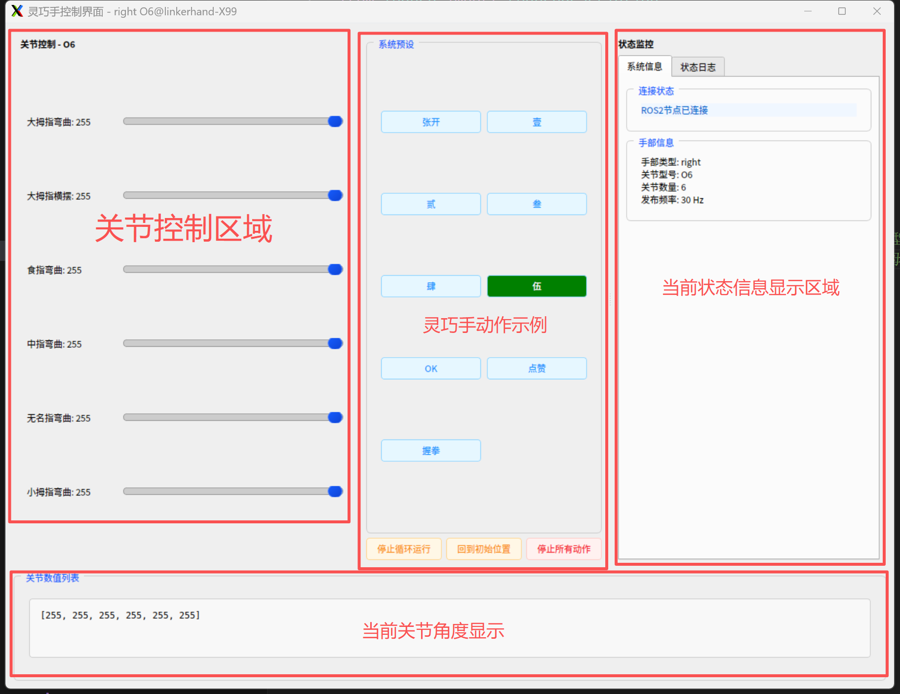

# LinkerHand 灵巧手 ROS2 SDK For O30

O30 高自由度灵巧手的 ROS 2 驱动：CANFD (HOP 协议)


[](https://github.com/linker-bot/linkerhand-o30-ros2)

**目录**：[1. 概述](#1-概述) · [2. 安全警告](#2-安全警告) · [3. 版本说明](#3-版本说明) ·
[4. 关节说明](#4-o30-关节说明) · [5. 准备工作](#5-准备工作) · [6. 启动 SDK](#6-启动-sdk) ·
[7. Topic 说明](#7-topic-说明) · [8. 自检与测试](#8-自检与测试) · [9. 已知限制](#9-已知限制) ·
[10. 常见问题](#10-常见问题-faq) · [11. 许可证](#11-许可证)

# 1. 概述

LinkerHand 灵巧手 ROS2 SDK 由灵心巧手(北京)科技有限公司开发，是 O30 等 LinkerHand 灵巧手的
驱动软件与功能示例源码，可用于真机与仿真器。

O30 为 **20 自由度** 灵巧手，采用 **HOP (Hand Object Protocol)** CANFD 协议、**11 位标准帧**
通信（已验证协议版本 v0.0.2 / v0.0.3 / v0.0.4），支持两种 CANFD 通信后端（金属 CANFD 盒 /
透明塑封 USB-CANFD 设备），并可选配指尖阵列式触觉传感器。

## 1.1 主要特性

* **两种通信后端**：`libcanbus`（厂商私有库，金属 CANFD 盒）与 `socketcan`（内核原生 `can0` + python-can）。
* **单字节关节接口**：20 个有效关节，位置 / 速度 / 力矩均为 `0 ~ 255`，话题为标准 `sensor_msgs/JointState`。
* **上电安全校验**：核对产品型号、左右手、协议名称与关节故障，任一致命项不通过则**不发出任何运动指令**。
* **输入校验与限位**：空列表 / `NaN` / `Inf` / 越界全部在下发前拦住，异常命令被丢弃或截断而不会变成错误动作。
* **诊断话题**：温度、电流、关节故障、通信错误码、在线状态、实测发布频率一并发布。
* **触觉 30 Hz**：五指指尖 10×7 点阵 + 合力，（见 [7.5](#75-触觉发布频率)）。
* **GUI 调试界面**：20 个关节滑块、预设手势、速度/力矩设置。
* **无硬件自检脚本**：不接设备即可回归安全逻辑（见 [8](#8-自检与测试)）。

## 1.2 仓库结构

| 路径 | 说明 |
| --- | --- |
| `linker_hand_o30_ros2_sdk/` | 驱动包（ROS 2 节点 + CANFD/HOP 协议实现） |
| `linker_hand_o30_ros2_sdk/linker_hand_o30_ros2_sdk/linker_hand_o30.py` | ROS 2 节点：参数、话题、安全链路、发布循环 |
| `linker_hand_o30_ros2_sdk/linker_hand_o30_ros2_sdk/core/canfd/` | HOP 协议与 CANFD 通信（`libcanbus` / `socketcan`） |
| `linker_hand_o30_ros2_sdk/launch/` | 单手 `linker_hand_o30.launch.py`、双手 `linker_hand_o30_double.launch.py` |
| `linker_hand_o30_ros2_sdk/test/node_safety_check.py` | 无硬件打桩自检脚本 |
| `gui_control/` | GUI 调试界面包 |
| `99-canfd.rules` / `99-double-canfd.rules` | CANFD 设备 udev 权限规则（单手 / 同总线双手） |
| `libcanbus*.tar` | 各架构 `libcanbus` 私有库（仅 `comm_type=libcanbus` 需要） |
| `requirements.txt` | Python 依赖 |

# 2. 安全警告

1. 请保持远离灵巧手活动范围，避免造成人身伤害或设备损坏。
2. 执行动作前请务必进行安全评估，以防止发生碰撞。
3. 请保护好灵巧手，通电自检期间(约 5 秒)手指会小幅运动，请勿触碰。
4. 默认 `auto_init_pose=True`，节点启动后会自动摆到初始姿态。**调试或首次上电建议先置
   `auto_init_pose=False`**，此时节点只连接、校验、发布状态，不发送任何运动指令。
5. 默认 `cmd_timeout=0.0`（deadman 关闭），上层节点崩溃时灵巧手会**保持最后一次目标姿态**。
   需要失联自动张开或失能，请设置 `cmd_timeout>0` 并选择 `deadman_action`（见 [6.1](#61-参数配置)）。

# 3. 版本说明

**V3.0.1**

1. 支持 O30 版 Linker Hand ROS2 驱动（HOP 协议 v0.0.2 ~ v0.0.4 已验证）。
2. 支持 `libcanbus`（金属 CANFD 盒）与 `socketcan`（透明塑封 USB-CANFD）两种通信后端。
3. 上电安全链路：产品型号 / 左右手 / 协议核对 + 关节故障检查通过后才允许运动；不通过则打印原因后退出，
   不建话题、不起控制线程（`strict_device_check`、`ignore_joint_faults`、`auto_init_pose`）。
4. 控制输入全量校验：长度（20 或 1 广播）、`NaN`/`Inf` 拒绝、`joint_limit_min/max` 截断。
5. deadman 命令流看门狗：`hold` / `open` / `disable` 三种失联处置。
6. 双手隔离：设置命令按 `params.hand_type` 分派，并新增单手话题 `/cb_<hand>_hand_setting_cmd`。
7. 诊断话题 `/cb_<hand>_hand_info`：温度、电流、关节故障、通信错误码、在线状态、deadman 状态、实测频率。
8. 触觉发布优化到 30 Hz：独立线程 + 单次读取同时取点阵与合力 + `touch_fingers` / `touch_publish_matrix` 裁剪。
9. GUI 控制界面：20 关节滑块、预设手势（握拳 / 张开 / 数字手势 壹~捌 / 赞）、循环预设动作、速度与力矩设置。
10. 新增无硬件打桩自检脚本 `test/node_safety_check.py`。

> **从旧版本升级需注意**
> * 控制话题的 `JointState.velocity` / `effort` **只接收、不下发**（默认填 `0`）；速度与力矩改由
>   `/cb_hand_setting_cmd` 的 `set_speed` / `set_max_torque_limits` 设置，是设备侧锁存值，各写一次即可。
> * 控制命令的长度必须是 **20 或 1**（1 时广播到全部关节），空列表或其它长度**整条丢弃**并告警；
>   旧代码若按 6/10 自由度发送短数组，现在不会再动，请发满 20 个值。
> * 触觉默认频率由 10 Hz 提高到 30 Hz，`is_touch=True` 时总线占用相应增加。
> * 触觉默认频率由 10 Hz 提高到 30 Hz，`is_touch=True` 时总线占用相应增加。

# 4. O30 关节说明

O30 共 **20 个有效电机**，关节按「类型分组」排列（横滚 → 航向 → 指根1 → 指根2 → 指尖），
组内手指顺序固定为 **拇指 → 食指 → 中指 → 无名指 → 小指**。控制 / 状态话题中的数组长度为 20，
顺序与下表完全一致，取值范围 **0 ~ 255**（单字节）。

| 序号 | 中文名称 | 英文名称（话题 `name` 字段） | 说明 |
| --- | --- | --- | --- |
| 0  | 拇指横滚 | thumb_roll   | 横滚组（仅拇指有横滚电机） |
| 1  | 拇指航向 | thumb_yaw    | 航向组 |
| 2  | 食指航向 | index_yaw    | 航向组 |
| 3  | 中指航向 | middle_yaw   | 航向组 |
| 4  | 无名指航向 | ring_yaw   | 航向组 |
| 5  | 小指航向 | little_yaw   | 航向组 |
| 6  | 拇指指根1 | thumb_root1  | 指根1(掌指)组 |
| 7  | 食指指根1 | index_root1  | 指根1组 |
| 8  | 中指指根1 | middle_root1 | 指根1组 |
| 9  | 无名指指根1 | ring_root1 | 指根1组 |
| 10 | 小指指根1 | little_root1 | 指根1组 |
| 11 | 食指指根2 | index_root2  | 指根2组（该组无拇指电机） |
| 12 | 中指指根2 | middle_root2 | 指根2组 |
| 13 | 无名指指根2 | ring_root2 | 指根2组 |
| 14 | 小指指根2 | little_root2 | 指根2组 |
| 15 | 拇指指尖 | thumb_tip    | 指尖组 |
| 16 | 食指指尖 | index_tip    | 指尖组 |
| 17 | 中指指尖 | middle_tip   | 指尖组 |
| 18 | 无名指指尖 | ring_tip   | 指尖组 |
| 19 | 小指指尖 | little_tip   | 指尖组 |

> 位置语义：一般 `200` 附近为「弯曲」端、`0` 附近为「伸直」端，静止值约 `25~40`
> （以实测 `/cb_*_hand_state` 为准，各关节方向以实物标定为准）。

**弧度换算**（驱动本身只收发 `0~255`；下列范围供上层 / GUI 的 `is_rad` 线性换算使用，顺序同上表） *注：仅作参考，具体数值以URDF为准。可在gui_control/utils/mapping.py中修改相应配置的值。

```text
最小弧度: [0.000, 0.000, -0.400, -0.380, -0.280, -0.280, 0.000, 0.000, 0.000, 0.000,
           0.000, 0.000, 0.000, 0.000, 0.000, 0.000, 0.000, 0.000, 0.000, 0.000]
最大弧度: [0.611, 2.094,  0.037,  0.054,  0.188,  0.281, 1.713, 1.729, 1.884, 1.963,
           1.850, 1.661, 1.707, 1.662, 1.703, 1.733, 1.763, 1.586, 1.675, 1.733]
```

# 5. 准备工作

## 5.1 系统与硬件需求

* 操作系统：Ubuntu 22.04
* ROS2 版本：Humble
* Python 版本：3.10+
* 硬件：amd64_x86 / arm64，配备 USB-CANFD 设备

O30 支持以下两类 CANFD 设备，对应不同的通信后端 `comm_type`：

| CANFD 设备 | comm_type | 说明 |
| --- | --- | --- |
| 蓝色 / 黑色金属 CANFD 盒 | `libcanbus` | 使用厂商私有库 `libcanbus.so`，需按 5.2 解压安装 |
| 透明塑封 USB-CANFD 设备 | `socketcan` | 内核原生 SocketCAN（`can0` + python-can），无需安装驱动 |

## 5.2 金属 CANFD 盒配置 (comm_type = libcanbus)

将对应架构的 `libcanbus` 库解压到 `/usr/local/lib/` 目录下：

```bash
$ tar -xvf "libcanbus(ubuntu22).tar" -C /usr/local/lib/
```

配置环境变量：

```bash
$ export LD_LIBRARY_PATH=$LD_LIBRARY_PATH:/usr/local/lib
```

库文件说明（`libcanbus.a` 为静态库，`libcanbus.so` 为共享库）：

| 库文件 | 适用编译器 / 环境 |
| --- | --- |
| libcanbus_arm       | arm-linux-gnueabihf-gcc |
| libcanbus_arm64     | aarch64-linux-gnu-gcc |
| libcanbus(ubuntu20) | gcc version 9.4.0 |
| libcanbus(ubuntu22) | gcc version 11.3.0 |

常见问题：

* 编译提示 `pthread` 相关错误，说明自带 libusb 库不匹配：`sudo apt-get install libusb-1.0-0-dev`，并删除 `/usr/local/lib` 下的 libusb 相关文件。
* 提示 `ludev` 错误：`sudo apt-get install libudev-dev`。
* 找不到 `cc1plus`：`sudo apt-get install --reinstall build-essential`。

设备权限：root 用户可直接读写 usbcan 设备。非 root 用户需修改 usbcan 模块操作权限，可将 `99-canfd.rules` 放到 `/etc/udev/rules.d/`，然后执行：

```bash
$ sudo udevadm control --reload-rules
$ sudo udevadm trigger
```

重启系统生效。（同总线双手可参考 `99-double-canfd.rules`。）

## 5.3 透明塑封 USB-CANFD 设备配置 (comm_type = socketcan)

1. 确保 type-c 接口下方的开关拨到 **Linux 模式**（若 `lsusb` 显示为 `STM32 Virtual ComPort`，说明仍是串口模式）。
2. 重新插拔 USB，确认接口枚举为原生 CAN：

```bash
$ ip -br link show type can
```

3. SDK 默认 `auto_setup=True`，会自动执行 `sudo ip link` 拉起 `can0` 接口（仲裁 1Mbps / 数据段 5Mbps）。因此运行需具备 `sudo` 权限；也可提前手动配置：

```bash
sudo ip link set can0 down
sudo ip link set can0 type can bitrate 1000000 sample-point 0.8 dbitrate 5000000 dsample-point 0.75 fd on
sudo ip link set can0 up
```

> 注意：波特率必须与灵巧手一致（默认仲裁 1Mbps、数据段 5Mbps）。若接口状态出现 `BUS-OFF` / `ERROR-PASSIVE`，通常是波特率不匹配、接线或终端电阻问题。

## 5.4 下载

```bash
$ mkdir -p ~/Linker_Hand_O30_ROS2_SDK/src    # 创建工程目录
$ cd ~/Linker_Hand_O30_ROS2_SDK/src
$ git clone https://github.com/linker-bot/linkerhand-o30-ros2.git
```

得到的目录结构：

```text
Linker_Hand_O30_ROS2_SDK/
└── src/
    └── linkerhand-o30-ros2/
        ├── linker_hand_o30_ros2_sdk/   # 驱动包
        ├── gui_control/                # GUI 包
        └── requirements.txt
```

## 5.5 安装依赖与编译

```bash
$ cd ~/Linker_Hand_O30_ROS2_SDK/src/linkerhand-o30-ros2
$ pip install -r requirements.txt          # 安装 Python 依赖(含 python-can)
$ cd ~/Linker_Hand_O30_ROS2_SDK            # 回到工程根目录
$ colcon build --symlink-install           # 编译和构建 ROS 包
$ source ./install/setup.bash
```

# 6. 启动 SDK

## 6.1 参数配置

编辑 `src/linkerhand-o30-ros2/linker_hand_o30_ros2_sdk/launch/linker_hand_o30.launch.py`，
按下表配置参数：

| 参数 | 取值 | 说明 |
| --- | --- | --- |
| `hand_type`    | `left` \| `right` | 左右手（小写）。同总线双手需各自配置不同帧 ID |
| `hand_joint`   | `O30` | 型号（大写） |
| `is_touch`     | `True` \| `False` | 是否装配指尖触觉传感器 |
| `canfd_device` | `0` \| `1` | **仅 libcanbus**：CANFD 设备编号，先插为 0，后插为 1；单设备填 0 |
| `comm_type`    | `libcanbus` \| `socketcan` | 通信后端：金属盒填 `libcanbus`，透明塑封 USB-CANFD 填 `socketcan` |
| `channel`      | `can0` | **仅 socketcan**：SocketCAN 接口名 |
| `bitrate`      | `1000000` | **仅 socketcan**：仲裁段波特率（须与灵巧手一致） |
| `dbitrate`     | `5000000` | **仅 socketcan**：数据段波特率 |
| `auto_setup`   | `True` \| `False` | **仅 socketcan**：`True` 时自动 `sudo ip link` 拉起接口 |

安全与诊断参数（均有默认值，可不填）：

| 参数 | 默认 | 说明 |
| --- | --- | --- |
| `auto_init_pose`        | `True`    | 校验全部通过后是否自动摆到 `init_pose`。`False` 时节点只连接/校验/发布状态，**不发任何运动指令** |
| `init_pose`             | 见 launch | 上电目标姿态（20 个，`0~255`） |
| `init_velocity`         | `200`     | 上电速度（`0~255`） |
| `init_torque`           | `200`     | 上电力矩（`0~255`） |
| `self_test_delay`       | `5.0`     | 上电自检等待秒数（摆位前） |
| `strict_device_check`   | `True`    | 产品型号 / 左右手 / 协议名称与配置不符时**拒绝启动**；`False` 时降级为告警 |
| `supported_protocol_versions` | `['0.0.2','0.0.3','0.0.4']` | 已验证的协议版本，不在表内只告警（提示字段偏移可能变动） |
| `ignore_joint_faults`   | `False`   | 上电检出「执行器离线/异常」时是否照样启动（默认拒绝；堵转/过流/过温始终只告警） |
| `joint_limit_min` / `joint_limit_max` | `0` / `255` ×20 | 各关节位置限位，超范围的命令值被截断到此区间 |
| `cmd_timeout`           | `0.0`     | deadman 超时秒数，`<=0` 关闭。**收到第一条控制命令后**才开始计时 |
| `deadman_action`        | `hold`    | 超时处置：`hold` 保持当前目标 / `open` 伸直五指（只动 root1+tip）/ `disable` 失能关节 |
| `state_rate`            | `30.0`    | 状态发布与命令下发频率 Hz |
| `touch_rate`            | `30.0`    | 触觉发布频率 Hz（独立线程，见 [7.5](#75-触觉发布频率)） |
| `touch_fingers`         | `[1,2,3,4,5]` | 要读取的触觉传感器编号（1 拇指 ~ 5 小指、6 手掌）。启动时与实机探测结果求交集，减少手指数可线性提高实测频率 |
| `touch_publish_matrix`  | `True`    | `False` 时只发合力话题 `*_matrix_touch_mass`，不发点阵话题 |
| `info_rate`             | `1.0`     | 诊断信息发布频率 Hz |
| `publish_velocity` / `publish_effort` | `True` | 状态里是否带实时速度 / 电流（各多一次总线读，可关掉换取更高 `state_rate`） |
| `temp_warn`             | `90`      | 过温告警阈值 °C（设备自报阈值为 90） |

> 上电顺序为「连接 → 读产品信息 → 核对型号/左右手/协议 → 关节故障检查 → （可选）摆位」。

## 6.2 启动单手

```bash
$ cd ~/Linker_Hand_O30_ROS2_SDK
$ source ./install/setup.bash
$ ros2 launch linker_hand_o30_ros2_sdk linker_hand_o30.launch.py
```

打印设备产品信息表并显示「校验通过」即连接成功（`auto_init_pose=True` 时随后会等待自检约 5 秒再摆位，请勿触碰）：

```text
产品型号      O30
供电电压范围  12V~24V
设备唯一标识  LHO30-03.1-023-R-J-3-A
协议名称      HOP
协议版本      0.0.4
控制板版本    V1.x.x
编译时间      2026-0x-xx xx:xx:xx
支持协议      CAN,UART
左右手        RIGHT
传感器类型    thumb:…、index:…、middle:…、ring:…、pinky:…
正在校验 O30-RIGHT 设备，请稍候...
✅ 全部有效关节无故障
✅ O30-RIGHT 设备校验通过
等待设备自检 5.0s 后摆到初始姿态...
✅ 上电摆位完成（速度 200 / 力矩 200）
✅ 触觉发布 5 指 [1, 2, 3, 4, 5] @ 30.0Hz（实测频率见 /cb_right_hand_info 的 touch_hz）
✅ Topics话题初始化完毕
```

> 实际字段随固件版本略有差异；`设备唯一标识` 为空说明设备没有应答（见 [10](#10-常见问题-faq)）。

## 6.3 启动双手

同总线双手使用 `linker_hand_o30_double.launch.py`，其中两个节点分别配置
`hand_type: 'left'` / `'right'`（`libcanbus` 后端还需按实际插入顺序配置 `canfd_device`）：

```bash
$ ros2 launch linker_hand_o30_ros2_sdk linker_hand_o30_double.launch.py
```


## 6.4 启动 GUI 控制 O30 灵巧手

启动 SDK 后，新开一个终端启动 GUI。

> 注：GUI 需要图形界面，不能通过纯 SSH 远程连接开启，请使用带图形界面的终端或 X11 转发。

编辑 `src/linkerhand-o30-ros2/gui_control/launch/gui_control.launch.py` 配置左右手、型号等参数，然后启动：

```bash
$ cd ~/Linker_Hand_O30_ROS2_SDK
$ source ./install/setup.bash
$ ros2 launch gui_control gui_control.launch.py
```

GUI 提供 20 个关节滑块、预设动作按钮（握拳 / 张开 / 数字手势 壹~捌 / 赞）、循环预设动作、
回到初始位置、停止所有动作，以及速度 / 力矩设置与状态日志。



# 7. Topic 说明

SDK 按 `hand_type` 动态生成话题名（下表以左手 `left` 为例，右手将 `left` 替换为 `right`）。触觉相关话题仅在 `is_touch=True` 时创建。

| Topic | 类型 | 方向 | 说明 |
| --- | --- | --- | --- |
| `/cb_left_hand_control_cmd`       | `sensor_msgs/JointState` | 订阅 | 左手控制命令 |
| `/cb_left_hand_state`             | `sensor_msgs/JointState` | 发布 | 左手实时关节状态（position/velocity/effort） |
| `/cb_left_hand_info`              | `std_msgs/String`        | 发布 | 左手诊断 JSON：温度/电流/关节故障/通信错误码/在线状态/deadman/实测频率 |
| `/cb_left_hand_matrix_touch`      | `std_msgs/String`        | 发布 | 左手指尖触觉点阵（`is_touch=True`，可用 `touch_publish_matrix=False` 关闭） |
| `/cb_left_hand_matrix_touch_mass` | `std_msgs/String`        | 发布 | 左手指尖触觉合力与统计（`is_touch=True`） |
| `/cb_hand_setting_cmd`            | `std_msgs/String`        | 订阅 | 设置命令（全局话题，双手节点都会收到，按 `params.hand_type` 分派） |
| `/cb_left_hand_setting_cmd`       | `std_msgs/String`        | 订阅 | 设置命令（单手话题，只有左手节点收到） |

查看话题列表：

```bash
$ source ./install/setup.bash
$ ros2 topic list
```

## 7.1 控制命令 `/cb_*_hand_control_cmd`

控制话题使用 `sensor_msgs/JointState`，**只有 `position` 会下发到设备**：

* `position`：20 个目标位置，顺序见 [第 4 节](#4-o30-关节说明)，取值 `0 ~ 255`。
* `velocity` / `effort`：只接收、**不下发**，默认填 `0` 表示「不在这里控制」。速度与力矩是设备侧
  **锁存的设定值**，请用 [7.4](#74-设置命令-cb_hand_setting_cmd) 的 `set_speed` /
  `set_max_torque_limits` 各设一次即可，一直有效；跟着每条位置命令重复下发只会白占总线事务。
  若这两个字段带了非 0 值，终端会给出一条限流提示（30 秒一次）。

`position` 的长度必须是 **20 或 1**（1 时广播到全部关节）。空列表、其它长度、含 `NaN`/`Inf`
的命令**整条丢弃**并告警（计入 `/cb_*_hand_info` 的 `rejected_cmds`）——短数组不会按首元素广播，
否则 6/10 自由度的上层会把 20 个关节全部推到同一个位置。超出
`joint_limit_min ~ joint_limit_max` 的值会被**截断**后下发（底层是 `& 0xFF`，`256` 会变成 `0`、
负数会回绕成大值，故必须在此拦住）。

> 设置命令写进去的速度 / 力矩是**锁存值**，驱动会记住已写入的内容，重复设置同一个值时不再写总线；
> 改动过关节使能（deadman `disable`、`enable_joints` / `disable_joints`）之后缓存失效，下一次设置会重写一遍。

命令行示例（右手全部关节移动到中位 80）：

```bash
$ ros2 topic pub --once /cb_right_hand_control_cmd sensor_msgs/msg/JointState \
"{position: [80,80,80,80,80,80,80,80,80,80,80,80,80,80,80,80,80,80,80,80]}"
```

## 7.2 状态反馈 `/cb_*_hand_state`

`sensor_msgs/JointState`，`name` 为 20 个关节英文名，`position` 为实时位置（`0 ~ 255`），
`velocity` / `effort` 为实时速度 / 电流原始值（由 `publish_velocity` / `publish_effort` 控制，关闭时填 0）。

```bash
$ ros2 topic echo /cb_right_hand_state
```

## 7.3 诊断信息 `/cb_*_hand_info`

`std_msgs/String`，内容为 JSON，默认 1 Hz（`info_rate`）：

```bash
$ ros2 topic echo /cb_right_hand_info
```

| 字段 | 说明 |
| --- | --- |
| `model` / `side` / `uid` / `protocol` | 设备产品信息（上电读取后缓存） |
| `joint_names` | 20 个关节英文名，顺序同状态话题 |
| `online` | 心跳是否递增（比发一次在线查询省一个事务） |
| `temperature` / `over_temp` | 各关节温度 °C / 达到 `temp_warn` 阈值的关节 |
| `current` | 各关节实时电流原始值 |
| `joint_faults` | `{关节名: 故障中文名}`，无故障时为空 |
| `comm_error` | 通信错误码（MI 0x4F）及其名称 |
| `deadman` | `{enabled, timeout, action, tripped}` |
| `rejected_cmds` / `read_fail` | 被校验拒绝的命令数 / 总线读失败次数 |
| `state_hz` / `touch_hz` | **实测**发布频率（每秒结算一次），对应目标为 `state_rate_target` / `touch_rate_target` |
| `touch_fingers` | 实际在读的触觉传感器编号 |

> ⚠️ 实时电流 / 速度未标定（`255` 不代表堵转，部分关节恒为 0），温度请与设备自报的 90 °C 阈值比较；
> 判断堵转 / 过流 / 过温请用 `joint_faults`。

## 7.4 设置命令 `/cb_hand_setting_cmd`

`std_msgs/String`，内容为 JSON 字符串：

```bash
$ ros2 topic pub --once /cb_hand_setting_cmd std_msgs/msg/String \
'{data: "{\"setting_cmd\": \"set_speed\", \"params\": {\"hand_type\": \"right\", \"speed\": [255]}}"}'
```

| `setting_cmd` | `params` | 说明 |
| --- | --- | --- |
| `set_speed`             | `speed`: 长度 20 或 1 的列表 | 设置目标速度（`0 ~ 255`） |
| `set_max_torque_limits` | `torque`: 长度 20 或 1 的列表 | 设置力矩（`0 ~ 255`） |
| `get_faults`            | —                            | 终端打印各关节故障 |
| `get_info`              | —                            | 重读并打印设备信息 |
| `enable_joints`         | —                            | 使能全部有效关节 |
| `disable_joints`        | —                            | 失能全部关节（清 ENABLED 位） |

> **双手隔离**：`/cb_hand_setting_cmd` 是全局话题，双手启动时两个节点都会收到同一条消息，
> 因此 `params.hand_type` 必须写明目标手（`left` / `right`），节点只处理与自身 `hand_type` 相同的命令；
> 填 `both` / `all` 或不填才视为广播。也可直接发到单手话题 `/cb_<left|right>_hand_setting_cmd`。
>
> `speed` / `torque` 长度为 20 时按关节顺序生效，长度为 1 时广播到全部关节；空列表与其它长度
> 被整条拒绝（会告警，见 [7.1](#71-控制命令-cb_hand_control_cmd)）。速度 / 力矩值与上一次相同时不重复写总线。

## 7.5 触觉发布频率

指尖触觉为 **10 × 7 阵列**，一次读取同时得到点阵与合力（合力就在数据区开头），分别发到两个话题：

```jsonc
// /cb_right_hand_matrix_touch —— 点阵
{"stamp": 1789091815889266353, "hand_type": "right", "sensors": {"1": {"name": "thumb", "rows": 10, "cols": 7, "matrix": [[0, 0, 0, 0, 0, 0, 0], [0, 0, 0, 0, 0, 0, 0], [0, 0, 0, 0, 0, 0, 0], [0, 0, 0, 0, 0, 0, 0], [0, 0, 0, 0, 0, 0, 0], [0, 0, 0, 0, 0, 0, 0], [0, 0, 0, 0, 0, 0, 0], [0, 0, 0, 0, 0, 0, 0], [0, 0, 0, 0, 0, 0, 0], [0, 0, 0, 0, 0, 0, 0]]}, "2": {"name": "index", "rows": 10, "cols": 7, "matrix": [[24, 38, 48, 54, 56, 52, 38], [46, 71, 84, 91, 94, 102, 78], [61, 97, 105, 112, 111, 111, 109], [66, 90, 96, 102, 99, 106, 107], [58, 78, 89, 89, 91, 87, 90], [67, 85, 93, 90, 96, 95, 100], [54, 73, 81, 79, 76, 75, 69], [58, 68, 65, 63, 61, 56, 51], [36, 54, 42, 36, 32, 30, 27], [0, 0, 0, 0, 0, 0, 0]]}, "3": {"name": "middle", "rows": 10, "cols": 7, "matrix": [[27, 39, 42, 53, 45, 35, 25], [71, 96, 90, 91, 92, 95, 70], [85, 94, 99, 98, 98, 97, 78], [83, 95, 94, 97, 97, 96, 86], [84, 95, 87, 88, 89, 86, 79], [81, 92, 93, 88, 84, 82, 71], [62, 71, 76, 72, 67, 59, 45], [40, 41, 38, 30, 27, 25, 20], [0, 0, 0, 0, 0, 0, 0], [0, 0, 0, 0, 0, 0, 0]]}, "4": {"name": "ring", "rows": 10, "cols": 7, "matrix": [[35, 58, 67, 80, 70, 57, 39], [63, 92, 96, 106, 98, 100, 80], [93, 108, 104, 107, 109, 107, 105], [84, 99, 97, 102, 100, 102, 85], [59, 79, 84, 87, 88, 81, 65], [25, 38, 41, 40, 39, 33, 23], [0, 8, 10, 5, 5, 0, 0], [11, 27, 27, 21, 16, 14, 11], [10, 31, 20, 20, 14, 13, 10], [0, 22, 10, 10, 0, 0, 0]]}, "5": {"name": "pinky", "rows": 10, "cols": 7, "matrix": [[0, 0, 0, 0, 0, 0, 0], [0, 0, 0, 0, 0, 0, 0], [0, 0, 0, 0, 0, 0, 0], [0, 0, 0, 0, 0, 0, 0], [0, 0, 0, 0, 0, 0, 0], [0, 0, 0, 0, 0, 0, 0], [0, 0, 0, 0, 0, 0, 0], [0, 0, 0, 0, 0, 0, 0], [0, 0, 0, 0, 0, 0, 0], [0, 0, 0, 0, 0, 0, 0]]}}}

// /cb_right_hand_matrix_touch_mass —— 合力与统计
{"stamp": 1789091792057111883, "hand_type": "right", "sensors": {"1": {"name": "thumb", "unit": "g", "force": {"FnS": 0}, "cell_sum": 0, "cell_max": 0}, "2": {"name": "index", "unit": "g", "force": {"FnS": 190}, "cell_sum": 1615, "cell_max": 71}, "3": {"name": "middle", "unit": "g", "force": {"FnS": 509}, "cell_sum": 3299, "cell_max": 98}, "4": {"name": "ring", "unit": "g", "force": {"FnS": 494}, "cell_sum": 3000, "cell_max": 94}, "5": {"name": "pinky", "unit": "g", "force": {"FnS": 0}, "cell_sum": 0, "cell_max": 0}}}
```

`sensors` 的 key 为传感器编号字符串（`"1"` 拇指 ~ `"5"` 小指）。`force` 的 key 直接取协议
「数据分布描述」里的标签（`FnS` 法向力合力、`FtS` 切向力合力、`FdS` 切向力方向）；
**描述里没有声明的字段不会出现**，此时用上位机算的 `cell_sum` / `cell_max` 近似。

触觉在**独立线程**里读取，与状态发布 / 命令下发互不排队（总线本身串行，两者的事务交替进行，
所以开触觉不会把控制延迟整段拖住）。默认 `touch_rate=30.0`，**五指全开实测约 29.85 Hz、周期抖动 31~35 ms**
（`libcanbus` 后端 + amd64 上位机）。

能不能跑满设定值，取决于总线上要做多少次事务：

| 项目 | 每周期事务数 |
| --- | --- |
| 每个触觉手指 | 1 次「选择传感器」写 + `ceil(数据长度/61)` 次带应答读（70 字节的指尖传感器 = 2 次） |
| 五指触觉 | 约 15 次 |
| 状态读（位置 + 可选速度 / 电流） | 1 ~ 3 次 |

30 Hz 意味着每 33 ms 要跑完这些事务。不达标时按下面顺序降配置：

1. 减少 `touch_fingers`（只读真正参与抓取的手指，事务数线性下降）；
2. 关掉 `touch_publish_matrix`（只保留合力话题）；
3. 关掉 `publish_velocity` / `publish_effort`（状态每周期各省一次总线读）；
4. 双手同总线时两只手要分带宽，`touch_rate` 建议 ≤ 15。

**不要凭设定值下结论**，看实测：

```bash
$ ros2 topic echo /cb_right_hand_info --field data | grep -o '"touch_hz":[0-9.]*'
$ ros2 topic hz /cb_right_hand_matrix_touch_mass
```

`touch_hz` / `state_hz` 低于设定值 80% 时终端也会给出降频提示（10 秒限流）。


# 8. 已知限制

* **手掌触觉**：本机未安装手掌传感器（编号 6），`touch_fingers` 里填 6 会在启动时被剔除并告警。
* **实时电流 / 速度未标定**：`current` / `velocity` 为原始值，`255` 不代表堵转，部分关节恒为 0；
  判断异常请用 `joint_faults`（堵转 / 过流 / 过温由固件判定）。
* **温度阈值**：设备自报过温阈值 90 °C，`temp_warn` 默认与之一致；正常负载下指根温度可达 60~70 °C。
* **协议版本**：字段偏移随 HOP 版本变动。`supported_protocol_versions` 之外的版本仍可运行，
  但会打印告警——升级固件后请核对产品信息表是否仍然正确。
* **弧度接口**：驱动只收发 `0~255` 单字节，弧度换算由上层 / GUI 完成（见 [第 4 节](#4-o30-关节说明)）。
* **GUI**：不含触觉可视化界面，触觉数据请用 `ros2 topic echo` 或自行订阅。

# 9. 常见问题 (FAQ)

* **未找到 CANFD 设备 / 打开设备失败**（libcanbus）：确认已按 5.2 安装 `libcanbus.so` 并设置 `LD_LIBRARY_PATH`，检查设备权限（udev 规则）。
* **未找到网络接口 can0**（socketcan）：确认 type-c 下方开关拨到 Linux 模式并重新插拔 USB，用 `ip -br link show type can` 确认接口出现。
* **总线 BUS-OFF / 设备无应答**（socketcan）：检查波特率是否与灵巧手一致（仲裁 1M / 数据段 5M）、接线与终端电阻。
* **设备初始化失败（设备唯一标识为空）**：检查硬件连接、`hand_type` 与 `comm_type` 配置是否与实际设备一致。
* **提示「左右手不符」/「产品型号不符」并退出**：`hand_type` / `hand_joint` 与实机不一致（双手常见于接反或帧 ID 冲突）。
  改对配置即可；确认要按现状运行可置 `strict_device_check=False` 降级为告警。
* **提示「致命关节故障: 执行器离线/异常」并退出**：该关节与执行器通信不上或不可恢复故障，先断电检查连接；
  确认安全后可置 `ignore_joint_faults=True` 强行启动（仅排障用）。
* **启动后手不动**：确认 `auto_init_pose` 是否为 `False`（此时节点只连接不摆位），以及控制命令长度是否为 20。
* **上层节点失联后手仍保持最后姿态**：这是 `deadman_action=hold` 的默认行为；需要自动张开或失能请设
  `cmd_timeout>0` 并选择 `open` / `disable`。
* **触觉发布频率上不去 / `touch_hz` 远低于 `touch_rate`**：总线是串行的，五指触觉每周期约 15 次事务。
  按 [7.5](#75-触觉发布频率) 依次减少 `touch_fingers`、关掉 `touch_publish_matrix`、关掉
  `publish_velocity` / `publish_effort`；双手同总线时把 `touch_rate` 降到 15 以内。
* **双手启动后互相干扰**：设置命令必须写明 `params.hand_type`，或直接发到单手话题
  `/cb_<left|right>_hand_setting_cmd`；`libcanbus` 后端还要确认两只手的 `canfd_device` 与帧 ID 不冲突。
* **GUI 无法启动**：确认使用带图形界面的终端（非纯 SSH），依赖 `pyqt5` 已安装。

# 10. 许可证

本项目以 [Apache License 2.0](LICENSE) 开源，版权归 灵心巧手(北京)科技有限公司 所有。

`libcanbus*.tar` 为设备厂商提供的私有二进制库，不在本许可证覆盖范围内，仅供配合本 SDK 使用。

**免责声明**：灵巧手为可运动的机电设备，请在评估安全后使用本 SDK；因未遵守
[第 2 节 安全警告](#2-安全警告) 而造成的人身伤害或设备损坏，作者与版权方不承担责任。

问题反馈与功能建议请提交 [GitHub Issue](https://github.com/linker-bot/linkerhand-o30-ros2/issues)。
